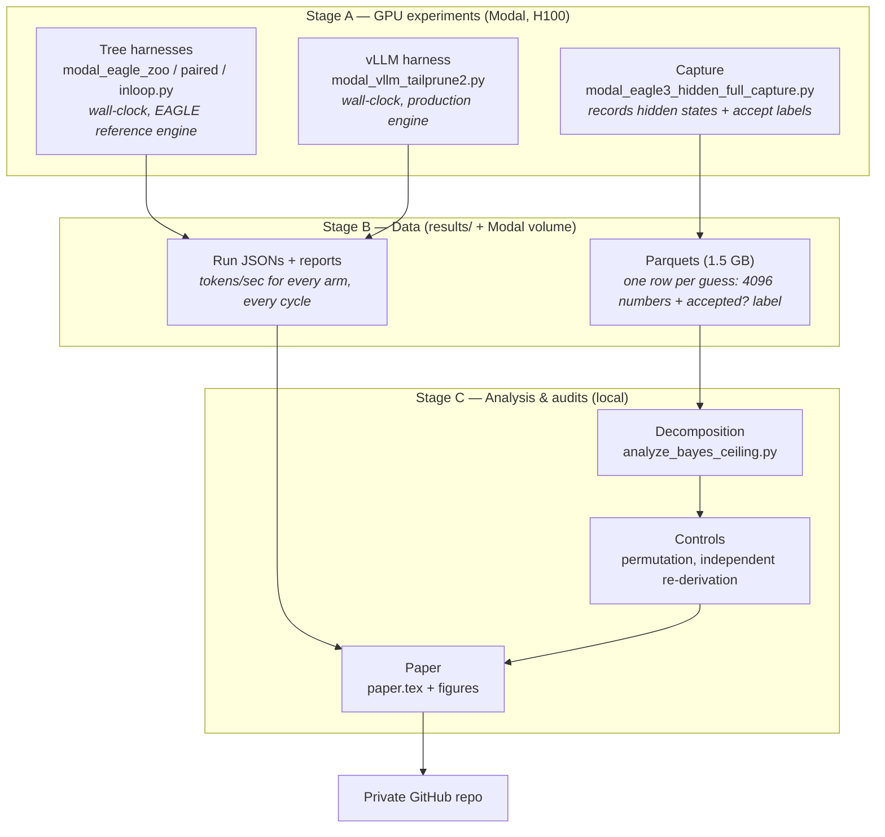
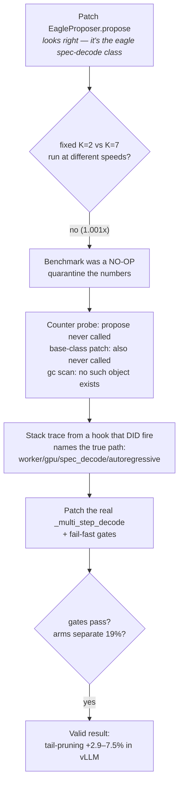

# Architecture & Algorithms — a novice-friendly guide

> **Looking for the deep version?** [RESEARCH_GUIDE.md](RESEARCH_GUIDE.md) covers the
> full evolution of the research (every fork and why), file-by-file and
> function-by-function flows including the BCSD in-engine harness, and the math
> explained with child-level examples (η-rule, ledger, chain gating, the exact
> Hellinger identity). This page remains the quick Lane-A (audit) intro.

*What this project did, how the code fits together, and how each conclusion was earned.
No prior knowledge of speculative decoding required.*

---

## 1. The idea in one paragraph

Big language models write one word at a time, and each word costs a full pass through a huge
model. **Speculative decoding** speeds this up: a *tiny* "draft" model guesses the next K words
cheaply, then the big "target" model checks all K guesses in **one** pass. Correct guesses are
kept (the output is bit-identical to normal decoding); wrong ones are thrown away. The knob is
**K — how many words to guess before checking**. The research field claimed you should adjust K
on the fly with clever signals, promising up to +25%. **We tested that claim end to end and
found: the promise is mostly an illusion, the clever methods lose money, and one free,
signal-less rule is the only thing that works.**

---

## 2. Glossary (the 10 words you need)

| Term | Plain meaning |
|---|---|
| Draft model / head | The tiny fast model that guesses words (EAGLE-3, ~1 layer) |
| Target model | The big model whose output we actually want (e.g. Llama-3.1-8B) |
| K / draft length / depth | How many words to guess before checking |
| Acceptance | A guess is "accepted" if the big model would have written the same word |
| Tuned fixed K | The best *constant* K found by trying them all — our honest baseline |
| Oracle | An impossible policy that knows the future: always guesses exactly the right amount |
| Hidden state | The draft model's internal 4096-number "thought vector" for each guess |
| Probe | A small classifier trained to read the hidden state and predict acceptance |
| Chain confidence | The running product of each guess's probability — how sure the draft is about the *whole* chain |
| Wall-clock | Real measured tokens/second on a real GPU (as opposed to a simulation formula) |

---

## 3. System architecture

**Why two engines in Stage A?** vLLM is what people deploy, but its draft loop was hard to
modify (see §7). The EAGLE reference engine is plain Python — easy to modify — so we proved
things there first, then replicated inside vLLM.

---

## 4. Algorithm 1 — Speculative decoding (background)

For each "step" until the reply is finished:

1. Draft model guesses tokens `g1, g2, …, gK` one after another (each is a *cheap* forward pass).
2. Target model runs **once** over all K guesses and marks each "same as I would have written?"
3. Keep the accepted prefix (`g1..gm` where `g(m+1)` was the first mismatch), plus one free
   corrected token from the target.
4. Go to 1.

The trade-off: bigger K → fewer expensive target passes *if* guesses survive, but wasted cheap
passes when they don't.

---

## 5. Algorithm 2 — The Bayes-ceiling decomposition (our measuring stick)

**Question:** of the famous "oracle +25%", how much could *any* real controller ever get?

1. **Capture** (Stage A): for ~50,000 guesses per model, record the draft's hidden state and
   whether the guess was accepted.
2. Score every policy with one formula: `speedup = (accepted per step + 1) / (1 + C·K)`,
   where C is the drafting cost per token (one draft forward as a fraction of a target
   forward). This is the standard speculative-decoding cost model (Leviathan et al. 2023;
   Chen et al. 2023), with one change: those papers *model* the numerator as
   `(1−α^(K+1))/(1−α)`, which assumes each chain position is accepted independently — we
   substitute the **measured** mean accepted-per-step instead. That matters, because we
   later measured that acceptances are *not* independent (lag-1 autocorrelation ρ = 0.307
   vs a shuffled null of 0.000, z = 47), so the modelled numerator would have been
   systematically wrong on this data.

   **Which C:** the ladder in `analyze_bayes_ceiling.py` is computed at a deliberately
   conservative proxy **C = 0.15**. Separately, fitting the model to the measured EAGLE-3
   fixed-K throughput sweep gives **C ≈ 0.066–0.072** (RMSE ≈ 0.01; reproduces measured
   H100 throughput to ~1%), and re-grounding the ladder there moves Llama recovery from
   +18.9% to +17.3% of the oracle (+2.9% net over tuned fixed K) — i.e. **the conclusion is
   stable across both cost coefficients**, which is the stronger claim. Scripts:
   `measured_cost_ground.py` (the fit).

   **Assumptions, all since tested:** (i) target verify cost is flat in K — *proven* at B=1
   by the microbench (q=2–8 dead flat, 18.5→18.2 ms) and explicitly **not** assumed at
   batch; (ii) no per-step switching overhead, so any adaptive-policy number from this
   formula is an **upper bound** — which is exactly why the probe's offline +2–3% became
   −2 to −17% in real wall-clock; (iii) C constant across K (fit residual ~1%).
3. Compute five ladder rungs, each a "what if". **All rungs are scored on the same test rows
   within each of 8 generation-split folds** (`analyze_bayes_ceiling_paired.py`), so the
   comparisons are paired and properly nested:
   - `best fixed K` — the tuned constant (baseline);
   - `Bayes(position)` — best possible policy that only knows the guess's position
     (**must** equal fixed K; if it doesn't, the pipeline is broken — a built-in self-test);
   - `probe (deployable)` — a classifier on the hidden state with its threshold chosen on the
     fold's *training* generations, scored on the fold's held-out ones. This is the only rung
     you could actually ship;
   - `probe (oracle threshold)` — the *same* probe scores on the *same* held-out rows, but
     with the threshold chosen to maximise performance on those rows. Impossible in practice;
     its only job is to price threshold-selection error. Because it differs from the rung
     above by the threshold alone, it bounds it **by construction in every fold** — which is
     itself a positive control;
   - `oracle` — K = (accepted count + 1), i.e. perfect hindsight (uses the realized outcome,
     so it is clairvoyant, not merely well-informed).
4. **Result (Llama-3.1-8B, 8 folds):** deployable **+16.8 ±2.6%** of the oracle span,
   oracle-threshold **+18.1 ±2.6%**, so the paired **threshold-selection loss is
   +0.0028 ±0.0015 speedup points — 1.2% of the span**. Threshold choice is genuinely
   exhausted. Both sit ~80% below the oracle: **only ~1/5 of the oracle gap is reachable;
   ~80% is coin-flip randomness in the verification outcome that nothing available before
   checking can predict.**

> **Naming caveat (kept deliberately).** We previously called the fourth rung
> "Bayes(hidden) — the ceiling for anything that reads the hidden state." That is stronger
> than what is computed. It removes *threshold-selection* error but not *hypothesis-class*
> error: a different probe architecture could in principle sit higher. It is therefore a
> ceiling **for this probe family**, and a lower bound on the true information-theoretic
> ceiling. The claim it fully supports is "threshold tuning is exhausted."
>
> **Superseded computation.** The original `analyze_bayes_ceiling.py` scored these two rungs
> on *different* data (deployable = 8-fold CV mean; the ceiling = threshold swept and scored
> on the **full** dataset), so they were not nested and the "ceiling" was actually beaten by
> the deployable probe (18.9% vs 17.8% on Llama; 18.3% vs 15.2% on Llama-reasoning) — fold
> noise, but enough to make the word "ceiling" unsupportable. The paired script above is the
> correct computation; the original is kept for the audit trail.

**Controls that make this trustworthy:**
- *Nesting control:* the oracle-threshold rung must beat the deployable rung in **every**
  fold. Passes 8/8.
- *Position self-test:* `Bayes(position)` must equal best fixed K exactly. Passes.
- *Permutation:* shuffle the accepted-labels across blocks → probe recovery collapses to ~0
  (so the signal is real, not leakage).
- *Independent re-derivation:* fresh code, different folds/seed, matches to <0.1 points.

---

## 6. Algorithm 3 — Saturation tail-pruning (the winner)

The only adaptive policy that survived every test. It needs **no training, no extra model, no
signal** — just a number the draft already computes:

1. `c ← 1` at the start of each step.
2. Draft one token; multiply `c ← c × p(top guess)` (the draft's own probability).
3. **If `c < threshold` (≈0.05–0.2) or K tokens drafted → stop guessing** and go verify.
4. Otherwise go to 2.

**Why it works when smart probes fail:** `c` is (approximately) the probability the *entire
chain so far* survives verification. When it collapses, further guessing is provably near-
worthless — that's a *deterministic* fact about numbers already computed. The probes instead
try to *predict a coin flip that hasn't happened*, and the reachable part of that prediction
is too small to pay for acting on it.

**Measured results (paired protocol, vs the strongest tuned fixed K):**

| Setting | Gain |
|---|---|
| Llama-8B, vLLM production engine (chain) | **+2.9 to +7.5%** |
| Llama-8B, EAGLE reference engine (tree) | **+3 to +5%** |
| Qwen3-14B, vLLM (chain) | +0.3 to +1.3% (never loses) |
| DeepSeek-R1 distill (weak draft head), tree | ~0 (tie) |
| Every *learned* policy (probe / entropy / margin) | **loses 2–17%** |

---

## 7. Algorithm 4 — The paired benchmarking protocol (how we made GPUs tell the truth)

Cloud-GPU speed drifts several percent *within one run* — enough to fake or hide a ±5% result.
Three of our own early runs gave +2.4%, −1.9%, +6.4% from **identical settings**. The fix:

1. Put every configuration ("arm") — each fixed K and each adaptive policy — into one list.
2. Benchmark them **round-robin**: arm1, arm2, …, armN, then again, for 4+ cycles,
   **rotating the order** each cycle.
3. Compare arms **within the same cycle** (paired differences) — drift hits both arms equally
   and cancels.
4. **Gates before trusting anything:**
   - the patched code actually executed (a counter proves it);
   - forcing K=2 actually drafts 2 (logged draft lengths prove it);
   - fixed arms *separate* (K=2 vs K=7 must differ — if they don't, you benchmarked a no-op).

### The four ways benchmarks lied to us (each caught by a control)

| # | Failure mode | How it fooled us | The catch |
|---|---|---|---|
| 1 | Mechanism mismatch | offline sim said +2–3%, reality said −6% (chain analysis deployed into a tree engine) | simulate the *same* mechanism you deploy |
| 2 | In-distribution tuning | +2.4% when thresholds were picked on the benched prompts; −1.9% on unseen prompts | held-out prompt split |
| 3 | Unpaired timing | three contradictory answers from identical configs | paired round-robin (above) |
| 4 | Dead-code patching | vLLM ships a look-alike spec-decode package that is never called; patching it silently benchmarks nothing | arm-separation gate + stack-trace from a hook that provably fires |

---

## 8. Component reference (what each key file does)

| File | Role |
|---|---|
| `modal_eagle3_hidden_full_capture.py` | Hooks vLLM's draft head; records hidden state + accept label per guess → Parquet |
| `analyze_bayes_ceiling.py` | The five-rung decomposition (Algorithm 2) |
| `analyze_bayes_ceiling_control.py` | Permutation control |
| `audit_decomposition.py`, `audit_probe_recovery.py` | Independent re-derivations (fresh code) |
| `measured_cost_ground.py` | Fits the cost constant C to real H100 throughput |
| `modal_eagle_zoo.py` / `modal_eagle_zoo_verify.py` | Four stop-policies through one loop; held-out verification |
| `modal_eagle_paired.py` | Paired round-robin protocol (Algorithm 4), tree engine |
| `modal_eagle_inloop.py` | The trained-probe early-stop, faithfully inside the draft loop |
| `modal_vllm_tailprune2.py` | The vLLM-native harness: patches the *true* draft loop with fail-fast gates |
| `modal_vllm_tailprune_diag*.py`, `modal_vllm_specpkg_dump.py` | The diagnosis chain that found vLLM's real draft loop |
| `analyze_make_figures.py` | Generates the three paper figures from result JSONs |
| `results/perstep_signal/*.md` | Human-readable verdicts: `bayes_ceiling`, `policy_zoo`, `pre_write_audit`, `wallclock_eagle` |
| `report/paper_draft.md` → `paper/paper.tex` | The paper (markdown = source of truth; LaTeX port) |
| `DELIVERABLES.md` | Index of every result (E1–E6) with reproduce commands |

Data not in git (regenerable): hidden-state parquets (Modal volume `spec-dec-m5-results`),
model weights.

---

## 9. The vLLM detective story (worth knowing — it's failure mode #4)

Lesson for anyone instrumenting a big framework: **the code that looks like the implementation
may be a parallel dead path. Prove your patch executes, and prove your arms differ, before
reading any number.**

---

## 10. FAQ

**Q: Does any of this change the model's answers?**
No. Verification is exact — output is bit-identical to normal decoding. Everything here is
about speed only.

**Q: Why is a "mostly negative" result valuable?**
Because the field's newest benchmark paper (SpecDecode-Bench) explicitly asked for a predictor
to close the oracle gap. We showed most of the gap is unclosable *in principle*, the predictors
lose money in practice, and a free rule captures what's capturable — plus a protocol for why
published ±5% claims don't replicate.

**Q: What should I actually deploy?**
Tune a fixed K per workload (deep where verification dominates), add the 3-line chain-confidence
stop (threshold ~0.05–0.2), and don't build acceptance predictors.

**Q: How do I reproduce a headline number?**
See `DELIVERABLES.md` — every result row has its script and command, e.g.
`modal run modal_vllm_tailprune2.py --model llama8b --n 10 --maxtok 128 --cycles 4`.

**Q: Where are the raw 1.5 GB captures?**
Modal volume `spec-dec-m5-results` (`eagle3_hidden_full/`), or regenerate with the capture
script (~$2 of H100 time per model).
