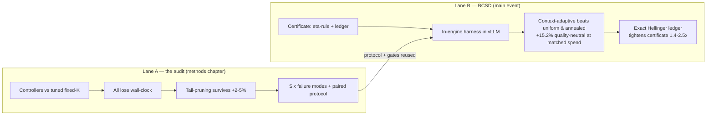
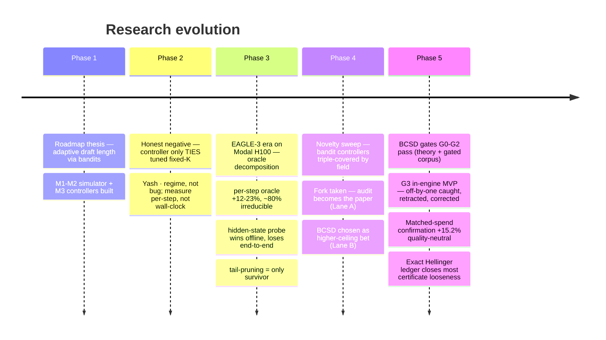
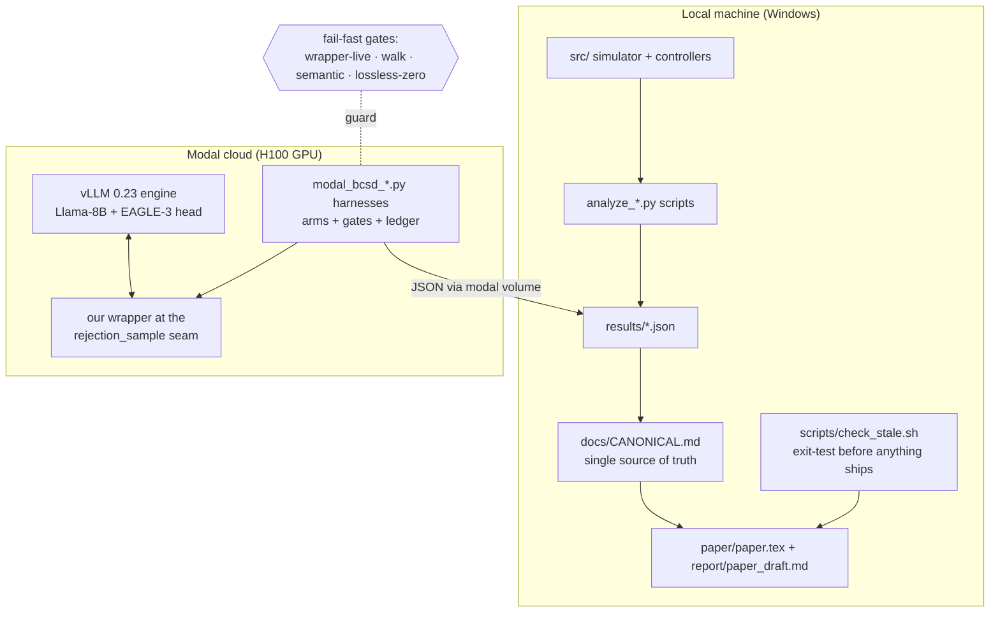
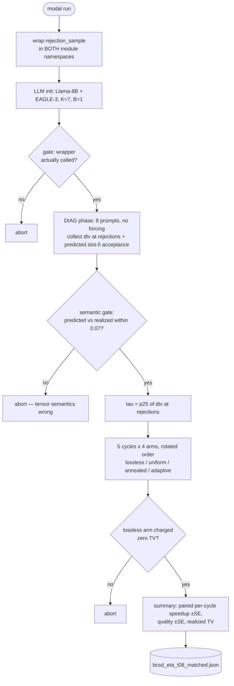

# The Complete Research Guide
### Architecture, file map, function flows, the math explained simply, and how we got here

> Companion to [ARCHITECTURE.md](ARCHITECTURE.md) (the quick novice intro) and
> [CANONICAL.md](CANONICAL.md) (the single source of truth for every number).
> This guide goes deeper: file-by-file, function-by-function, the math with
> child-level examples, and the full evolution of the research with every fork
> in the road explained.

---

## Part 1 — The whole project in one page

We study **speculative decoding (SD)**: a big "target" model checks batches of
tokens guessed by a small "draft" model, so text comes out faster without
changing what the big model would have said.

Two research lanes came out of one starting question:

- **Lane A (the audit, finished):** *"Everyone publishes adaptive draft-length
  controllers. How much speed is actually available to them?"* Answer, measured
  honestly: very little. Against properly tuned fixed baselines, every learned
  or entropy-based per-step controller we tested **loses** wall-clock time; the
  only surviving trick is a signal-free one (saturation tail-pruning, +2–5%,
  one workload a wash, and only at low batch). The real contribution is the
  **measurement methodology** — six documented ways SD benchmarks lie, and a
  paired protocol that catches them.

- **Lane B (BCSD, the main event, active):** *"If lossless SD's headroom is
  tiny, what if we allow the output to change a tiny, CONTROLLED amount?"*
  We built **Budget-Certified Speculative Decoding**: a knob ε that provably
  caps how far the generated text's distribution can drift from the target
  model's, plus a **context-adaptive policy** that spends that tiny allowance
  only where it is cheap. Measured inside vLLM: **+15.2% ±0.6 wall-clock at
  quality statistically indistinguishable from lossless**, while blind or
  position-scheduled ways to spend the same allowance get ~0% speed and lose
  25–33 points of GSM8K accuracy.

---

## Part 2 — How the research evolved (every fork, and why we turned)

### The five big decision points

| # | Decision point | Options on the table | What we chose | Why |
|---|---|---|---|---|
| 1 | Controller only ties tuned fixed-K. Now what? | (a) squeeze the controller, (b) report honestly and decompose the ceiling | **(b)** | The oracle decomposition showed ~80% of the per-step headroom is *irreducible* from draft-side signals — squeezing could never work. Yash's rule: "the bar is ~1.2×, and per-step metrics, not wall-clock hopes." |
| 2 | Probe finds signal (AUC 0.79–0.88) but recovers only ~19% of oracle. Publish as a win? | (a) headline the probe, (b) audit why high-AUC ≠ speed | **(b)** | Offline +2–3% became −2 to −17% *end-to-end* once real overhead was paid. That gap between offline simulation and wall-clock became the paper's spine: the audit. |
| 3 | What is the thesis now? (2026-06 novelty sweep) | (a) oracle measurement paper, (b) load+content controller, (c) certified lossy SD, (d) CUDA-graph systems substrate | **(a) as Lane A + (c) as Lane B** | (b) measured at ~3% ceiling — dead. (d) is engineering with prior art (SGLang tiered graphs). (c) had a verified unclaimed gap: nobody offers a *sequence-level certified* distribution bound + *adaptive* budget allocation. Yash: "audit = workshop-shaped; BCSD = the bar we set. Pick on purpose." We picked both, with roles. |
| 4 | Cool-SD (AAAI'26) turns out to also have a sequence-level TV bound. Abandon BCSD? | (a) drop it, (b) narrow the claim | **(b)** | Their schedule is position-only and *unenforced*. Ours: enforced ε-ledger + **context**-adaptive allocation. The in-engine result later proved this is exactly the part that matters (their family collapses quality at matched spend). |
| 5 | MVP shows adaptive dominating — but at half the baselines' spend (Yash round-4). | (a) scope the campaign on +17.6%, (b) rerun baselines at adaptive's spend first | **(b)** | "There's no point sizing it around +17.6% if the number's going to move." It moved to **+15.2% quality-neutral** — and the dominance *survived*, which converts a signal into a result. |

### The recurring meta-lesson (four artifacts caught)

Every wrong number this project almost shipped was caught by a **gate**, not by luck:

1. Flush-lag pairing bug in the (q,p) capture (implied acceptance 0.04 vs engine 0.40) → semantic gate.
2. Same bug retroactively found in the old June corpus → G2-prelim numbers retired.
3. Pareto "oracle" row that beat its own ceiling → accounting audit, row deleted.
4. **The off-by-one** (`draft_sampled[j+1]`, see Part 5) → semantic gate predicted acceptance ~0 vs realized 0.75, run aborted before any lossy arm executed; two runs retracted.

> **Rule that emerged:** *absence of anomaly is not a gate.* Every instrumentation
> layer must carry a POSITIVE invariant it must reproduce (e.g., "the η=0 re-walk
> must equal the kernel's accepted count on every call — 5,542/5,542").

---

## Part 3 — System architecture

The one non-obvious piece: **the seam**. vLLM's live speculative path (v0.23,
this config) decides acceptance inside a Triton kernel
(`v1/worker/gpu/spec_decode/rejection_sampler_utils.py::_rejection_kernel`).
We do not modify the kernel. We wrap the Python function `rejection_sample`
that returns its results, and **post-edit the returned tensors**
(`sampled`, `num_sampled`). The engine downstream honors whatever those
tensors say — proven by the fact that generations remain coherent and the
ledger pins the realized budget exactly.

---

## Part 4 — File-by-file map

Rule of thumb: `modal_*.py` = runs on a cloud GPU; `analyze_*.py` = runs
locally on saved JSONs; `src/` = the simulator-era library; `scratch/` =
exploration, never load-bearing; every number that matters ends up in
`results/*.json` and is quoted only via `docs/CANONICAL.md`.

### Lane B — BCSD (the active pipeline)

| File | What it does |
|---|---|
| `modal_vllm_accept_dump.py` | CPU-only spelunker: dumps vLLM's acceptance-related source to `results/vllm_accept_src.txt` so we could find the real seam (and later, the off-by-one). |
| `modal_bcsd_eagle_capture.py` | v4 capture of paired (draft q, target p) top-k distributions inside the verify hook, with **atomic pairing** and a semantic gate (implied vs engine acceptance). Produced the gated corpus `results/bcsd_dists_eagle_llama8b_v4.json`. |
| `analyze_bcsd_g1g2.py` | Gate G1 (are thresholds certifiable? No — 13–137× violations) and G2 (chain-aware allocation vs uniform: +10–63% at matched budget). |
| `analyze_bcsd_pareto.py` | Offline certified Pareto frontier: lossless / uniform / tuned-annealed / adaptive. Told us adaptive's *offline* edge over a tuned schedule is small (+1–6%) — later inverted in-engine. |
| `analyze_bcsd_telescoping.py` | Exact small-vocab enumeration: how loose is the telescoping certificate (~1.5–3×, growing ~√T) + Part 2: the Hellinger-accumulation candidate and its counterexamples. |
| `modal_bcsd_eta_mvp.py` / `_mvp2.py` | G3 MVP v1/v2 (T=0). **Retracted** — off-by-one in slot pairing; kept for the audit trail. |
| `modal_bcsd_eta_mvp3.py` | Corrected T=0 harness with the **positive walk gate**. Result: cheap edits exist; adaptive +6.0% at −5.2pp; blind edits collapse quality. |
| `modal_bcsd_eta_t08.py` | Corrected T=0.8 harness: TRUE η-rule with exact TV-costed ledger. First MVP table (+17.6% at −5.2pp on half cap). |
| `modal_bcsd_eta_t08_matched.py` | The **confirmation**: every lossy arm at the spend adaptive realized (ε=0.025), 5 paired cycles → +15.2 ±0.6% quality-neutral. |
| `report/bcsd_scoping.md` | The gate ledger: every gate, every result, every retraction, in order. |
| `report/bcsd_certificate_theory.md` | Lemma 1, Theorem 1, the ledger, chain-gating, Cool-SD relation, telescoping looseness, and the exact Hellinger ledger. |

### Lane A — the audit (frozen)

| File | What it does |
|---|---|
| `modal_microbench.py` | Verify-latency vs K microbench that turned "flat in K" from assertion into measurement (q=1 step, q=2–8 flat). |
| `modal_vllm_specbench.py`, `modal_spec_compare_pairs.py`, `modal_controller_benchmark.py` | The paired-protocol benchmark family: round-robin arms, rotated order, per-cycle paired deltas, fail-fast gates. |
| `modal_oracle_ceiling.py`, `modal_eagle3_perstep_capture.py` | Oracle decomposition + per-step trace capture used for the Bayes-ceiling analysis. |
| `src/explore_target_signal.py`, `src/verify_explore_perstep.py` | The hidden-state probe (PCA-50 logistic head) and its permutation control. |
| `src/controllers/*` | The simulator-era controllers (LinUCB, entropy, history, oracle, 2025 baselines) — the things the audit ultimately audited. |
| `src/serve/simulator.py`, `src/bench/harness.py` | M1-era trace simulator and bench harness. |
| `docs/CANONICAL.md` | Single source of truth for every number; retired figures marked. |
| `scripts/check_stale.sh` | Exit-test: greps the ship set (paper, draft, README) for retired claims; fails the build if any resurface. |
| `paper/paper.tex`, `report/paper_draft.md` | The audit paper ("An Audit Under Tuned Baselines and Paired Wall-Clock Protocols"). |

### Support

| File | What it does |
|---|---|
| `report/yash_reply_*.md` | The mentor correspondence, versioned; `_email.html` = Gmail-ready render. |
| `results/*.json` | Every measured number, one file per experiment, immutable once quoted. |
| `scratch/`, `yash_inputs/` | Exploration and mentor-supplied scripts; nothing here is load-bearing. |

---

## Part 5 — Function-by-function: the BCSD in-engine harness

The core file is `modal_bcsd_eta_t08_matched.py` (the corrected T=0.8 harness;
mvp3 is the same skeleton at T=0). Flow of one experiment:

### `eta_rejection_sample(processed_logits, draft_logits, draft_sampled, cu_num_logits, ...)`
**The wrapper — the only place we touch the engine.**

- **Input:** the tensors vLLM already computed for one decode step of one
  request: `processed_logits` `[K+1, V]` (target's distribution rows, already
  temperature-processed), `draft_sampled` (flat token ids where **slot j's
  draft token lives at index j+1** — the off-by-one that bit us),
  `draft_logits` (None for EAGLE-3 ⇒ draft treated as a point mass).
- **Calls the original** kernel first → `(sampled, num_sampled)`: the kernel's
  verdict, e.g. `num_sampled=[3]` = "2 draft tokens accepted + 1 correction".
- **Then, per arm:** walks forward from the kernel's first rejection. At each
  rejection slot it asks the *policy* for η; charges `η·d_TV` to the ledger;
  flips the rejection to acceptance with probability η; continues the walk with
  its own coin flips; samples the exact recovery/bonus token at the end.
- **Output:** possibly-extended `(sampled, num_sampled)`. The engine downstream
  treats them as the kernel's own.
- **Example:** kernel accepted 1 of 7. Adaptive arm sees the rejection slot has
  d_TV = 0.4 ≤ τ=0.74 → η=1 → flip. Continues: slots 2,3 accepted by own
  draws, slot 4 rejects with d_TV=1.0 > τ → stop, sample recovery there.
  Ledger += 1·0.4. Step now emits 5 tokens instead of 2.

### `probs_at(processed_logits, j, drafts)`
- **Input:** logits rows + slot index j.
- **Output:** `(p_row, a_j, dtv_j)` where `a_j = p(draft token)` = the exact
  probability the kernel would accept slot j (one-hot draft), and
  `dtv_j = 1 − a_j` = the exact per-token certificate price of forcing it.
- **Why trustworthy:** the semantic gate checks `mean(a_0)` against the
  engine's realized slot-0 acceptance every run (0.757 vs 0.747 ✓).

### `eta_policy(arm, tau, j, dtv)` — the three competing brains
- `uniform`: η=0.5 anywhere the ledger allows. (Spends allowance blindly.)
- `annealed`: η=0.8·e^(−0.5j) — big early, small late. Position-only; the
  Cool-SD family baseline.
- `adaptive`: η=1 **iff** `dtv ≤ τ`, else 0. ("Only buy cheap things.")

### `recovery(p, x)` / bonus sampling
Exactly reproduces the kernel's own rules (read from its source): recovery =
target row with the rejected token zeroed then renormalized; bonus = sample
from the full final row.

### The ledger (inline in the walk)
- `EL["Dhat"] += η·dtv` at every **engagement** (whether or not the flip wins —
  the distribution shift happens the moment you flip the coin, not when it
  lands).
- Enforcement: before engaging, `if Dhat/emitted ≥ EPS: stop relaxing`. This
  hard cap is what makes the budget *certified* rather than advisory: realized
  spend pins at 0.0250/0.0251 on the blind arms, every run.

### `bench(arm, tau, cycle)` / gates
Runs 32 GSM8K prompts through `llm.chat` (chat template — its absence was v1's
quality-axis bug), fixed per-(cycle,prompt) seeds shared across arms, returns
`{tps, quality, tv_rate, acc_per_step}`. The **walk gate** (mvp3) additionally
re-derives the kernel's accepted count with η=0 on every lossless call and
requires equality (5,542/5,542).

---

## Part 6 — The math, explained like you're five

### 6.1 Speculative decoding: the guessing game

The big model is a **teacher** who writes one word per minute. The small model
is a **student** who writes ten words a minute but makes mistakes. So the
student writes 7 words ahead, and the teacher checks all 7 *in one minute*
(checking is parallel; writing is not). Every word the teacher agrees with is
kept. At the first word the teacher dislikes, she crosses it out, writes her
own word there, and the student starts guessing again from that point.

Key fact: the final text is **exactly** what the teacher would have written
alone. Speed comes free — *if* the student guesses well.

### 6.2 d_TV (total variation distance): how different are two candy jars?

Jar P: 5 red, 3 blue, 2 green (out of 10). Jar Q: 3 red, 3 blue, 4 green.

d_TV = half the sum of the differences = ½·(|5−3| + |3−3| + |2−4|)/10 = **0.2**.

Interpretation a child gets: *if you pick one candy from each jar with your
eyes closed, 0.2 is the best possible chance anyone could ever have of telling
which jar it came from beyond guessing.* d_TV = 0 → jars identical.
d_TV = 1 → jars share nothing.

For us: P = teacher's word-distribution at this position, Q = student's.
`d_TV = 1 − p(student's word)` in our engine (the student names one word, so
their "jar" is all-one-color).

### 6.3 The η-rule (Lemma 1): a leniency dial with an exact price tag

Normally the teacher rejects a word she dislikes. The **η-rule** says: when
you would reject, flip a biased coin and *accept anyway* with probability η.

- η = 0 → normal teacher (lossless).
- η = 1 → accepts everything (text becomes the student's).

**Lemma 1 (the price tag is exact):** doing this at one position moves the
output distribution away from the teacher's by **exactly η · d_TV(P, Q)**.
Not "at most" — exactly.

Worked toy: teacher's jar P = {cat: 0.7, dog: 0.3}, student always says "dog"
(Q = {dog: 1}). d_TV = 1 − 0.3 = 0.7. With η = 0.1, the output becomes
{cat: 0.63, dog: 0.37} — which sits exactly 0.1·0.7 = **0.07** away from P in
d_TV. The dial's cost is perfectly known. That is what makes a *certificate*
possible — and it is why hard thresholds ("accept whenever d_TV < c") are
uncertifiable: their price depends on data you haven't seen (we measured
incumbent-style thresholds overshooting their claimed prices 13–137×).

### 6.4 The ledger: pocket money for mistakes

Give the system ε = 0.025 "distortion coins" per emitted token. Every time the
policy engages the η-rule at a slot, it must pay **η·d_TV** from the purse
*before* flipping the coin. Purse empty → no more leniency; the system silently
becomes lossless again. That's the entire enforcement mechanism, and it is why
the realized spend lands at 0.0250/0.0251 on arms that always try to spend:
the purse, not good intentions, is the guarantee.

### 6.5 Chain gating: why position matters (the ladder)

Draft tokens form a ladder: you can only stand on rung 4 if rungs 1–3 held.
So buying rung 1 with your budget can unlock the whole ladder above it, while
buying rung 6 buys at most rung 6. This is why *where* you spend beats *how
much*: per-rung, cost equals gain exactly (Lemma 1), so **all** allocation
value comes from the ladder structure. Offline this looked like "+10–63% for
smart allocation."

### 6.6 The plot twist: correlated disagreement (why in-engine inverted offline)

Offline, we modeled each rung's holding-probability as an independent coin.
Real chains are not like that: **if the teacher truly hated rung 3, she
usually hates rung 4 too** — one genuine disagreement predicts continued
disagreement, because the student has wandered off the teacher's path.

Consequences, both measured:
- Forcing an *expensive* rejection (d_TV ≈ 1, teacher actively disagrees) buys
  almost no ladder: the very next rung breaks anyway. And it poisons the text
  (the word the teacher hated is now in the answer). That is why **uniform**
  and **position-annealed** spending collapse GSM8K by 25–47 points for ~0%
  speed at matched budget.
- Forcing a *cheap* rejection (d_TV ≤ 0.74 — a genuine coin-flip loss, teacher
  was fine with the word) both keeps the text right AND the ladder tends to
  keep holding above it (acc/step 3.33 vs 2.70). That's the whole +15.2%.

> One-line moral: *the offline model priced rungs independently; real ladders
> break in runs. Only context-awareness can tell a coin-flip loss from a real
> disagreement — position in the sequence cannot.*

### 6.7 The sequence certificate and why it was loose (drunk walking)

Theorem 1 (telescoping): total drift over a whole answer ≤ **sum** of the
per-step prices. Safe, simple — and pessimistic, because per-step drifts point
in *different directions* and partially cancel, like a drunk person's steps:
after 100 one-meter steps they are ~10 meters from the bar, not 100. Measured
exactly (small vocab, all sequences enumerated): the linear bound overpays
1.5–3×, and the overpayment grows like √T.

### 6.8 The fix: the Hellinger ruler (an identity, not a bound)

There is a second ruler for comparing distributions, the **squared Hellinger
distance** H². Think of it as measuring with square roots:
H²(P,Q) = 1 − Σ√(p·q) — "1 minus how much the two jars overlap when you
compare square roots of proportions."

The discovery (verified exactly on all 48 enumeration cells, to 1e-12): if you
weight each step by the **geometric mean** of the two processes' prefix
probabilities (√(P̃·P*) — "the overlap path"), then the per-step H² prices
don't just bound the total — **they add up to it exactly**:

    H²(whole sequence) = Σ_t E_G[H²(step t)]      ← identity, zero slack

(Why: the "overlap mass" A_t shrinks by exactly E_G[H²_t] each step —
A_{t+1} = A_t − E_G[H²_t] — like a candle losing exactly the wax it burns.)
The weighting is load-bearing: use the natural P̃-weights instead and the
identity *fails* in 20/48 cells.

Then one classical inequality (d_TV ≤ √2·H) converts it to the certificate we
enforce. Net effect: the certificate tightens 1.4–2.5× at T=8, and **all**
remaining conservatism sits in that final conversion — the accumulation step,
which used to be the loose part, is now exact. Both ingredients (the weight
∏√(p/p̃) and per-step H²) are computable live at the engine seam, so this is
an implementable ledger, not a blackboard object. Open items, stated honestly:
truncation-robust enforcement, weight-variance over long sequences, and the
formal write-up of the three-line telescoping proof.

### 6.9 Why the certificate matters more than any one benchmark

The +15.2% is one model pair, one task. The *certificate* is the product: a
user turns a single dial ε and gets a mathematical guarantee about
distributional drift — something none of FSD / SPRINTER / AdaSD / DIVERSED
offer (their knobs are empirical) and Cool-SD's schedule doesn't enforce.
Benchmarks size the win; the certificate is why the win is trustworthy.

---

## Part 7 — The audit lane's algorithms in brief (Lane A)

Covered in depth in [ARCHITECTURE.md](ARCHITECTURE.md); one-line versions:

- **Bayes-ceiling decomposition:** split the per-step oracle's +12–23% into
  "predictable from draft-side signals" vs "irreducible coin flips" → ~80%
  irreducible → every acceptance-predicting controller is chasing noise.
- **Saturation tail-pruning (the survivor):** stop drafting when the chain's
  own survival probability estimate sags below 0.2 — signal-free, deterministic,
  +2–5%, one workload a wash, decays to ~0 by B=8 (mechanism: batch-synchronized
  mean-stop, measured, not verify-cost growth).
- **Paired protocol:** round-robin arms, rotated order, per-cycle paired
  deltas, and fail-fast gates (patched-code counters, arm separation,
  realized-depth logs, semantic cross-checks). Born from six documented ways
  our own benchmarks lied to us.
- **Verify microbench:** target verify latency is a step function in K —
  q=1 special-cased, q=2–8 flat (18.5→18.2 ms at B=1) — which is what makes
  padded-slot verification free at B=1 and the deployability caveat necessary.

---

## Part 8 — If you are new and want to reproduce something

1. **Read** [CANONICAL.md](CANONICAL.md) first — it is the map of claims.
2. **Cheapest full experience** (no GPU): `python analyze_bcsd_telescoping.py`
   — exact enumeration, prints the looseness table and the Hellinger result in
   seconds.
3. **The offline allocation story**: `python analyze_bcsd_g1g2.py` then
   `python analyze_bcsd_pareto.py` (uses the gated corpus JSON in `results/`).
4. **The real thing** (needs Modal + H100 budget, ~$5/run):
   `modal run modal_bcsd_eta_t08_matched.py --n 32 --maxtok 384 --cycles 5`.
   Watch the gates print before any result does — that ordering is the point.
5. Before quoting any number anywhere: `bash scripts/check_stale.sh`.
